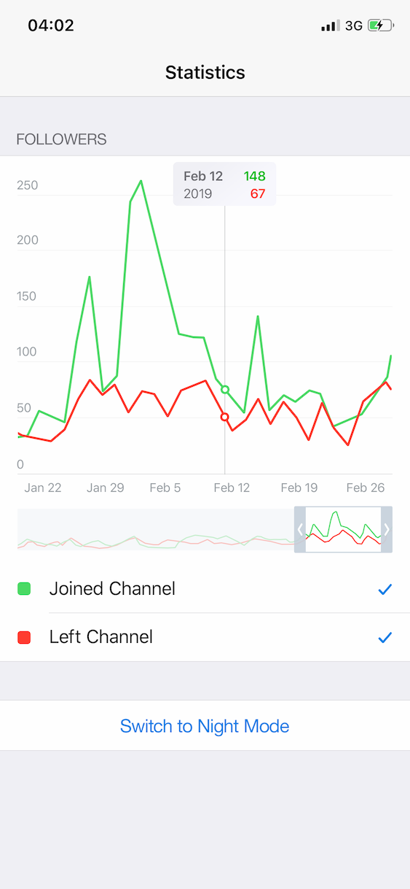
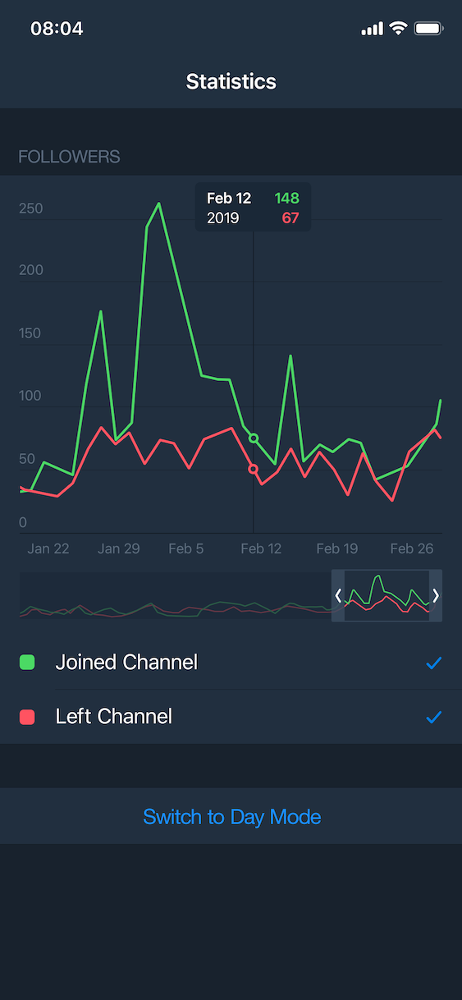

# Task
Telegram official coding competition for Android, iOS and JS developers. 

March 10-24, 2019.

The goal is to develop software for showing simple charts based on input data. You can use either JavaScript, Android Java or iOS Swift. 

Note: you may not use specialized charting libraries. All the code you submit must be written by you from scratch.

# Description
Use JSON file as input data for the 5 charts. It contains a vector of JSON objects ('chart'), each representing a separate graph.

chart.columns – List of all data columns in the chart. Each column has its label at position 0, followed by values.
x values are UNIX timestamps in milliseconds.

chart.types – Chart types for each of the columns. Supported values:
"line" (line on the graph with linear interpolation),
"x" (x axis values for each of the charts at the corresponding positions).

chart.colors – Color for each line in 6-hex-digit format (e.g. "#AAAAAA").
chart.names – Names for each line.

